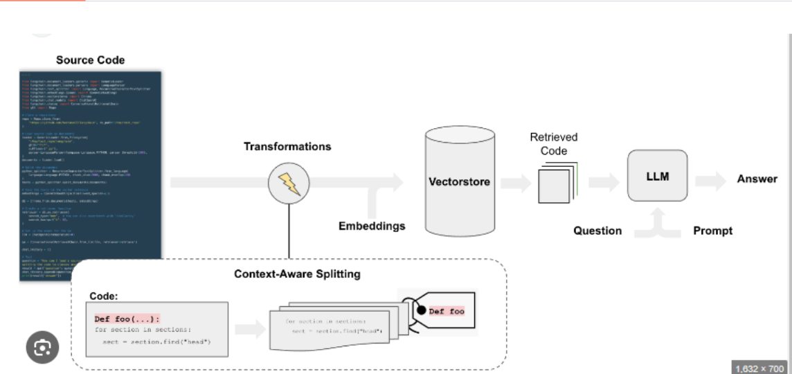
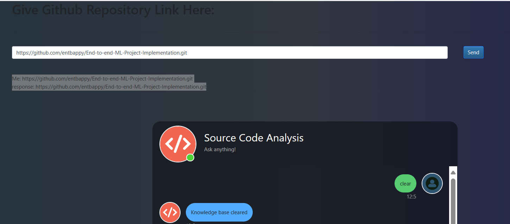
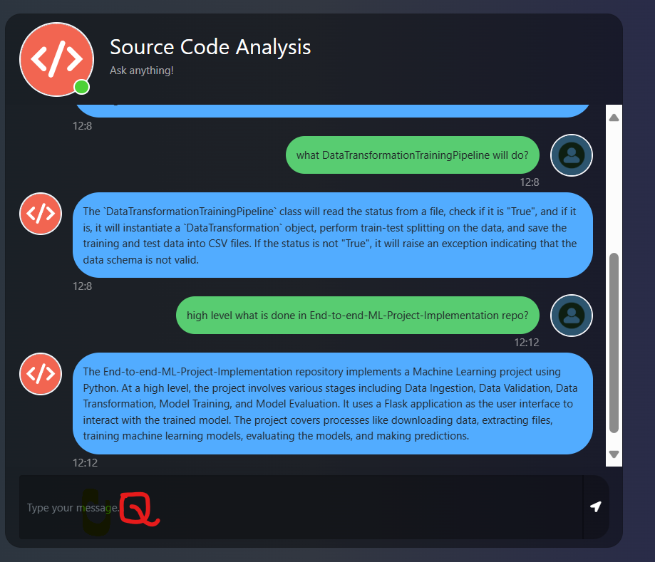

# Source-Code-Analysis-using-GenAI

- Here we apply **embedding on source code(others written python code)** and then we ask Q on that code to understand more about that code.
- It helps to **understand any of the code**.
- Here we are building Basic **RAG** end to end project,
- We created **CHROMA vector DB** for our I/P Repo, It reads all .py file and make as Knowledge base
- Used OpenAI model **ChatOpenAI() - Default gpt 3.5 Turbo** to produce the final output in **Flask webpage**
- Added **Langchain's ConversationSummaryMemory**



# ---------------------------------------------------------------------------

# Files

- **app.py:** Main file uses Flask and creates basic webpage and calls all main actions
- **store_index.py:** Does all source code knowledge base creation tasks like context based chunking - embedding - save in Chroma DB
- **src/helper:** Holds all main functions, which will be called inside app.py and store_index.py
- **init.py\* It helps to treat src folder's all files as package/internal library in **setup.py\*\*
- **setup.py:** It helps to convert src folder's **helper.py** files as package/internal library
- **requirement.txt:** Holds all required packages and its version
- **template Folder:** Holds flask **index.html**
- **static Folder:** Holds flask **jquery.min.js**
- **research folder:** Holds initial code **trials.ipynb** before convertig it to modularized code in app.py
- **repo folder:** Holds cloned repos all source codes, it wont be pushed to BB
- **db folder:** Chroma db all embeddings/Knowledge base saved here, it wont be pushed to BB
- **Generative_AI_Project.egg-info:** - This is the local package created on helper.py file, it wont be pushed to BB
- **.env:** Holds Open API Key, it wont be pushed to BB
- **tempalte.py:** Holds initial foder structure skeleton

# ---------------------------------------------------------------------------

# Steps written in app.py

- Here we created app.py file, it holds core script.
- Initiate the flask

## Clone the Source file from BB and download to local folder data

- In Flask Front end provide the **BB Link for specific repo** ,it will be cloned in app.py file and saved in **repo folder**, **GitPython** library will does this work.

## Local Vector DB creation

- Inside **app.py** it executes **store_index.py** which use langchain Loader - **GenericLoader.from_filesystem** to read the all **.py** files in cloned repo
- Then Split Text into Chunks .Here it wont do normal chunks, it does **context based Context Aware chunking** , so it holds **function name** as tag for that chunk. For this we used **Langchain's RecursiveCharacterTextSplitter.from_language**
- Use the **OpenAIEmbeddings** Model via Langchain and convert chunk to vector and stores embedding in local db - **Chroma db** inside folder **db**

## Use ChatOpenAI() from Langchain as LLM model and Build RAG

- Used langchain's **ConversationalRetrievalChain with ConversationSummaryMemory** to retrive chroma db context for User Q
- Use **ChatOpenAI() AS LLM** with **vectordb.as_retriever** created langchain's QA chain [RAG]

## Flask Framework

- Create **index.html** inside template folder with template info
- Create **jquery.min.js** in static folder with relevant content
- Execute flask **@app inside **main\*\*\*\*
- This helps to give one approval popup, then it allows us to open local webpage link
  - http://localhost:8080
- Then we can input our Q to flask , it executes backend model and retrives the O/P(Wait for 2 min)

## Flask Front End

- 1st need to pass Repo path which we need to clone in 1st promt.
- Once it clones and creats embedding **Knowledge base**, then ask Q in 2nd prompt.
- If we want to delete previously created **Knowledge base** then pass **clear** in prompt

# ---------------------------------------------------------------------------

# How to run?

### STEPS:

Clone the repository

```bash
Project repo: https://github.com/
```

### STEP 01- Create a conda environment after opening the repository

```bash
conda create -n llmapp python=3.8 -y
```

```bash
conda activate llmapp
```

### STEP 02- Create Basic folders

```bash
python template.py
```

### STEP 03- install the requirements

```bash
pip install -r requirements.txt
```

### Create a `.env` file in the root directory and add your OPENAI_API_KEY credentials as follows:

```ini
OPENAI_API_KEY = "xxxxxxxxxxxxxxxxxxxxxxxxxxxxx"
```

```bash
# Finally run the following command
python app.py
```

Now,

```bash
open up localhost: http://localhost:8080
```

- Pass this BB repo link for testing **https://github.com/entbappy/End-to-end-ML-Project-Implementation.git**

- Once we pass above link, it gives this as response

```
Me: https://github.com/entbappy/End-to-end-ML-Project-Implementation.git
response: https://github.com/entbappy/End-to-end-ML-Project-Implementation.git
```

- Then ask Q on this repo, Ex: high level what is done in End-to-end-ML-Project-Implementation repo?




### Techstack Used:

- Python
- LangChain
- Flask
- OpenAI
- GPT 3
- ChoromaDB
