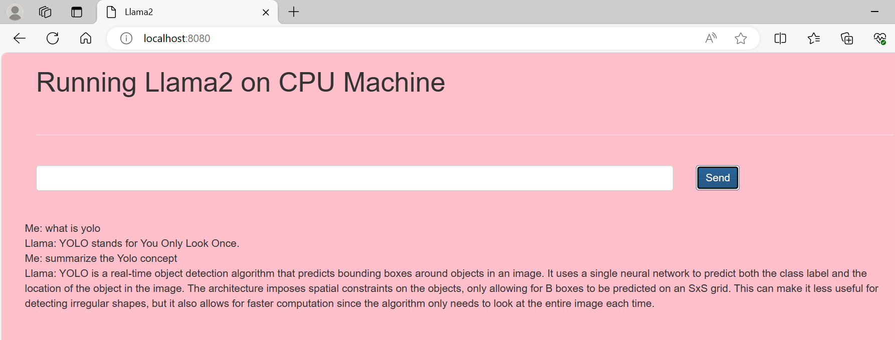

# Running-Llama2-on-CPU-Machine

- Here we are building Basic **RAG** end to end project,
- We created **FAISS vector DB** for our pdf file
- Used Quantized Llama2 model **llama-2-7b-chat.ggmlv3.q4_0.bin** to produce the final output in **Flask webpage**

# ---------------------------------------------------------------------------------

# Steps written in app.py

- Here we created app.py file, it holds core script.
- Initiate the flask

## Read the file to create RAG application

Load the local pdf file saved in data folder by langchain DirectoryLoader
Split Text into Chunks

## Local Vector DB creation

- Load the Embedding Model via hugging face to convert chunk to vector and save in FAISS db

## Initialte Quantized Llama2 LLM model

- Use **CTransformers** to load the Quantized model saved in **model** folder
- Create **Prompt Template** by using **langchain Prompt Template**

## Build RAG

- Create chain using langchains **RetrievalQA.from_chain_type** by passing **llm** model and **vector db**

## Flask Framework

- Create **index.html** inside template folder with template info
- Create **jquery.min.js** in static folder with relevant content
- Execute flask **@app inside **main****
- This helps to give one approval popup, then it allows us to open local webpage link
  - http://localhost:8080
- Then we can input our Q to flask , it executes backend model and retrives the O/P(Wait for 2 min)

# ---------------------------------------------------------------------------------

# How to run?

### STEPS:

Clone the repository

```bash
Project repo: https://github.com/
```

### STEP 01- Create a conda environment after opening the repository

```bash
conda create -n llmapp python=3.8 -y
```

```bash
conda activate llmapp
```

### STEP 02- install the requirements

```bash
pip install -r requirements.txt
```

```bash
python app.py
```

### Download the quantize model from the link provided in model folder & keep the model in the model directory:

```ini
## Download the Llama 2 Model:

llama-2-7b-chat.ggmlv3.q4_0.bin


## From the following link:
https://huggingface.co/TheBloke/Llama-2-7B-Chat-GGML/tree/main
```

## For Flask app:

- Copied some html template inside **templates/index.html** file
- Created some **static folder** and added **jquery.min.js** and copied some content inside that

```
Chat bot HTML Template:
        https://themeforest.net/search/chatbot
        https://getbootstrap.com/
```

## To run main script app.py which executes via Flask app:

- Type this in bash

```

python app.py

```

- Once we type, pop will come to run this app in local, just approve it
- Then open this link in explorer, we can see our app running

```
    http://localhost:8080
```

- We can give any Q here and send, it executes backend model and retrives the O/P(Wait for 2 min)


