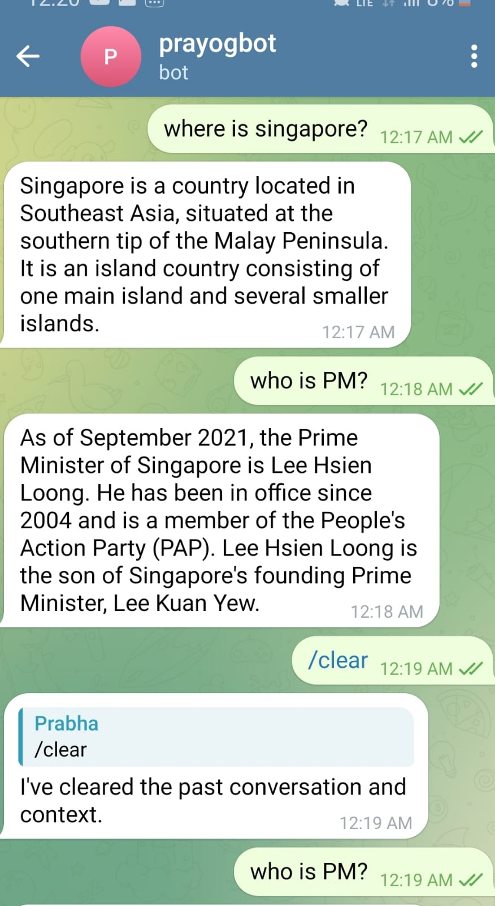
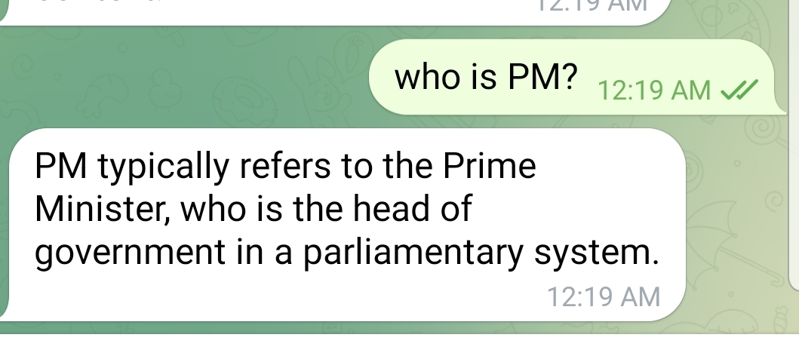
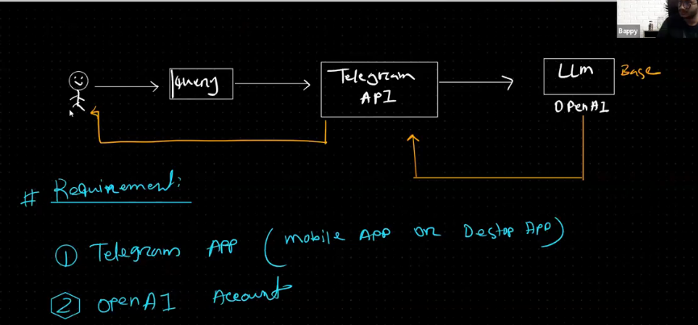
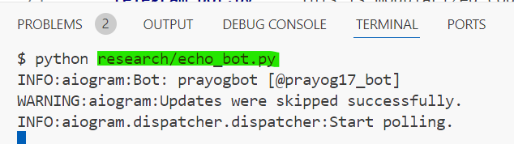
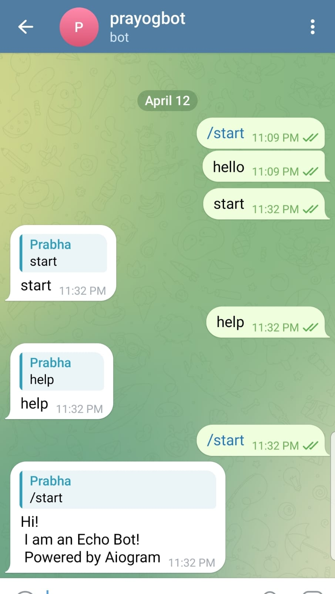
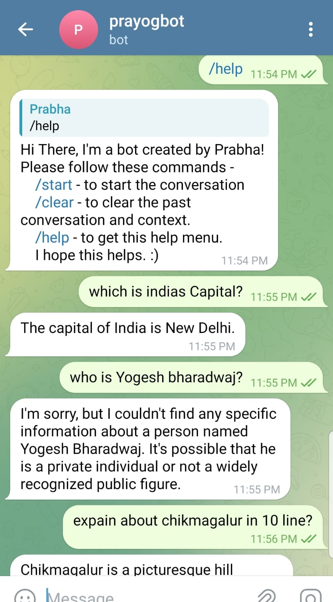

# Telagram-Bot-using-GenAI

- Here we are building basic **Telegram Bot** using GenAI. Similar way we can build **whatsapp** bot etc
- **AIogram docs** - Which shows steps related to **Telegram bot** connection etc

  - https://docs.aiogram.dev/en/latest/

- Here we are just doing basic operation using **OPENAI LLM**, But in future we can add **RAG** Concept with our own data and get the **Input Q** from **Telegram Bot** and send **RAG + LLM Output** to **Telegram Bot**
- Its like we are creating **END POINT(Telegram)** to our **GenAI Model**
- We can create multiple function, Like Getting ans from LLM /RAG etc for telebot Q
- This bot has **Memory**, what ever we asked it will **remember** and gives response related to prev Conversation, till we type **/clear** in our Telegram bot

  
  

- This bot we can deploy to **\*Cloud Platform** and get the respose in specific endpoint

## ------------------------------------------------------------

## Prerequisites

To follow this tutorial, you will need:

- Python 3.8 or higher
- A Telegram account and a smartphone
- An OpenAI account and an API key

# How to run?

### STEPS:

Clone the repository

```bash
Project repo: https://github.com/
```

### STEP 01- Create a conda environment after opening the repository

```bash
conda create -n telebot python=3.8 -y
```

```bash
conda activate telebot
```

### STEP 02- install the requirements

```bash
pip install -r requirements.txt
```

## ------------------------------------------------------------



## Initial setup Inside Telegram App

- 1. Open Telegram, search **BotFather** Then press start. Its telegram SDK to create bot
- 2. To create new bot type - **/newbot** -> Provide Bot name as - **prayogbot** (It should be unique)
- 3. Then provide username for bot - **prayog17_bot**

     - Now click on url to access the bot

     - Make sure you collect the access token and copied to .env file

### Add in .env

```ini
OPENAI_API_KEY=sk-xxxxxxxxxxxxxxxxxxxxxxxxxxxxx
TELEGRAM_BOT_TOKEN=xxxxxxxxxx:xxxxxxxxxxxxxxxxxxxxxxxxxxxxxxxxxxx
```

### **echo_bot.py** :

- This is initial code, before creting modular script - **telegram_bot.py**

  - To **run** this type this in bash

  ```bash
  python research/echo_bot.py
  ```

  
  

- **StoP Bot** - Press **Control+C**

### **telegram_bot.py** :

- This is modularized code, which is the main final script
- This connected to **OPENAI gpt-3.5-turbo** Model and provides response for all Q asked in telegram terminal

  - To **run** this type this in bash

  ```bash
  python telegram_bot.py
  ```

  

### Drive link for other integrations

[Link](https://drive.google.com/drive/folders/1JlvnNZczhDtwaypRavkiZjvxOnKp7bsW?usp=sharing)
