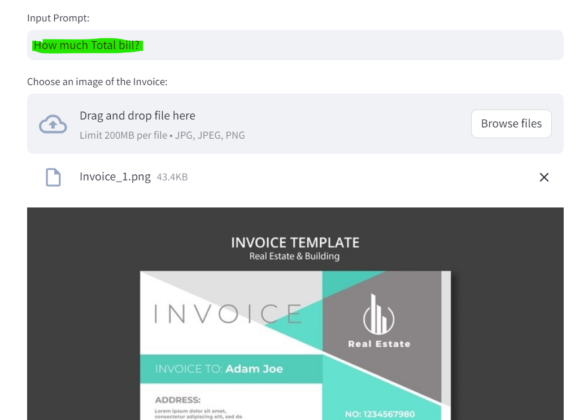
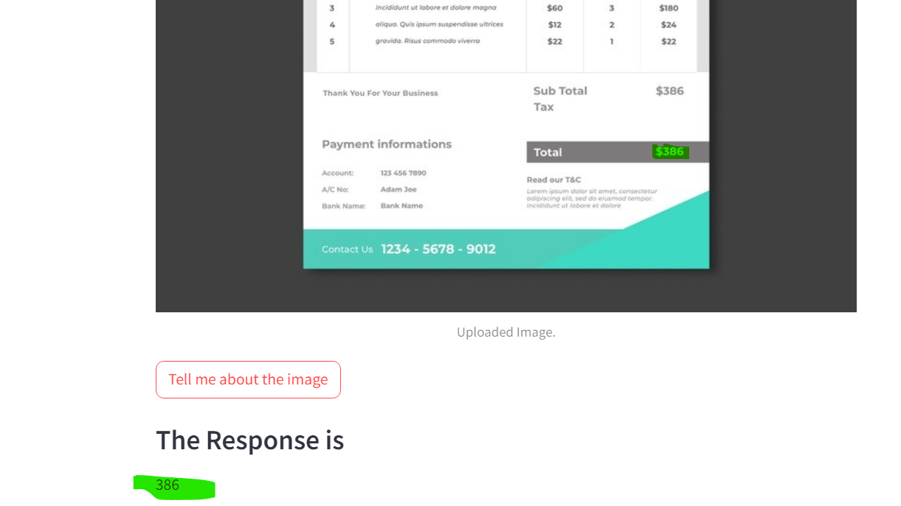
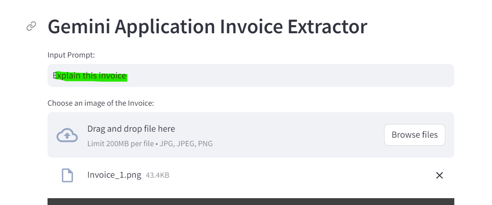
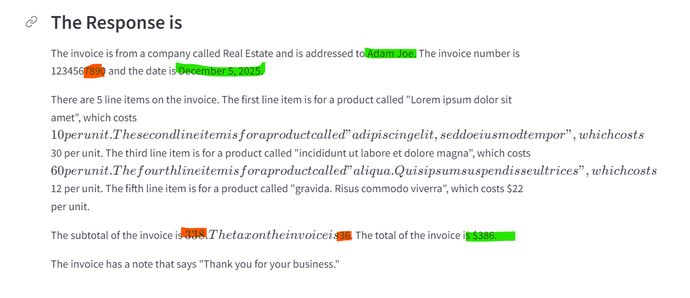
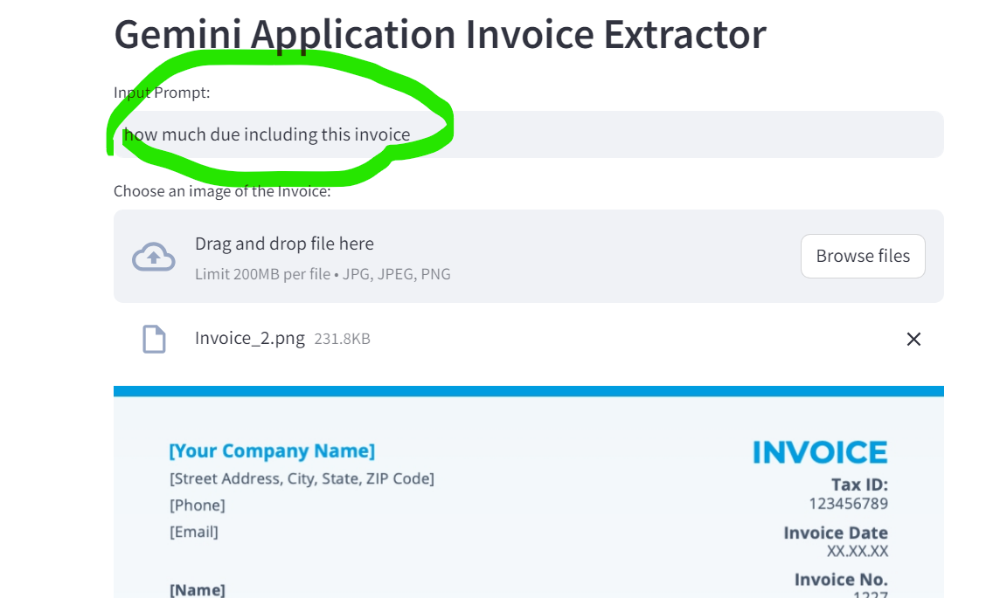
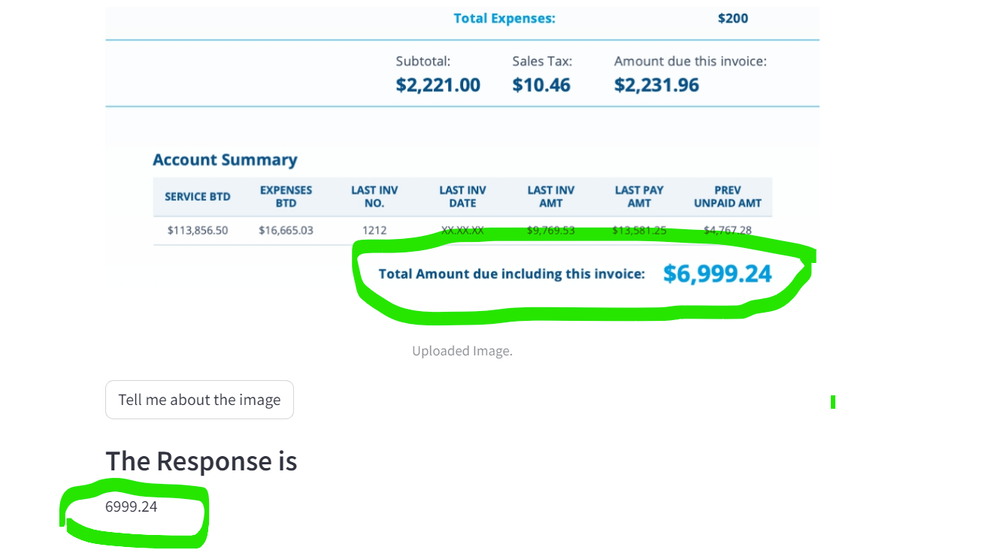

# Invoice Extractor using Gemini Pro - Q&A Chatbot

- Here we upload **invoice image** and ask Q,
- In backend it reads image details by **Geminipro- Vision API model** and provides O/P
- Here No RAG approach or knowledge base creation

# ---------------------------------------------------------------------------

# Files

- **app.py:** Main file uses Srtreamlit and creates basic webpage and executes all main actions
- **requirement.txt:** Holds all required packages and its version
- **.env:** Holds Gemini API Key, it wont be pushed to BB

# ---------------------------------------------------------------------------

## Streamlit Front End

- 1st need to upload invoice image and ask Q,
- In backend it reads image details by geminipro API model and provides O/P

# ---------------------------------------------------------------------------

# How to run?

### STEPS:

Clone the repository

```bash
Project repo: https://github.com/
```

### STEP 01- Create a conda environment after opening the repository

Here we need python 3.9 and above for geminipro

```bash
conda create -n gemenv python=3.9 -y
```

```bash
conda activate gemenv
```

### STEP 02- install the requirements

```bash
pip install -r requirements.txt
```

### Create a `.env` file in the root directory and add your GOOGLE_API_KEY credentials as follows:

```ini
GOOGLE_API_KEY = "xxxxxxxxxxxxxxxxxxxxxxxxxxxxx"
```

```bash
# Finally run the following command
streamlit run app.py
```

Now,

```bash
open up localhost: http://localhost:8080
```

- upload invoice image and ask Q, THEN it gives response

```bash
# Finally Stop the app
ctrl + C
```

### Sample Invoice 1:






### Sample Invoice 1:




# ---------------------------------------------------------------------------

### Techstack Used:

- Python
- Gemini Pro V
- Sreamlit
