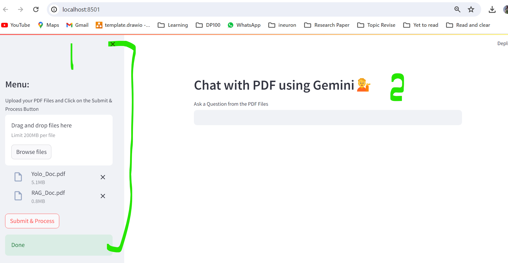
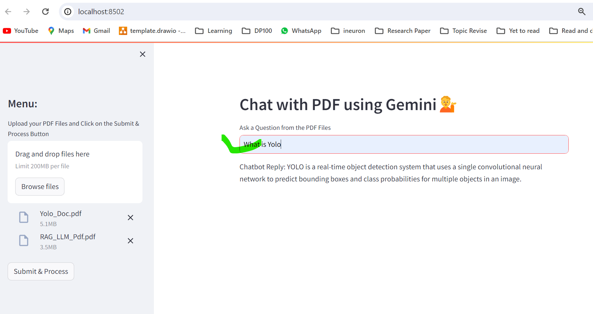
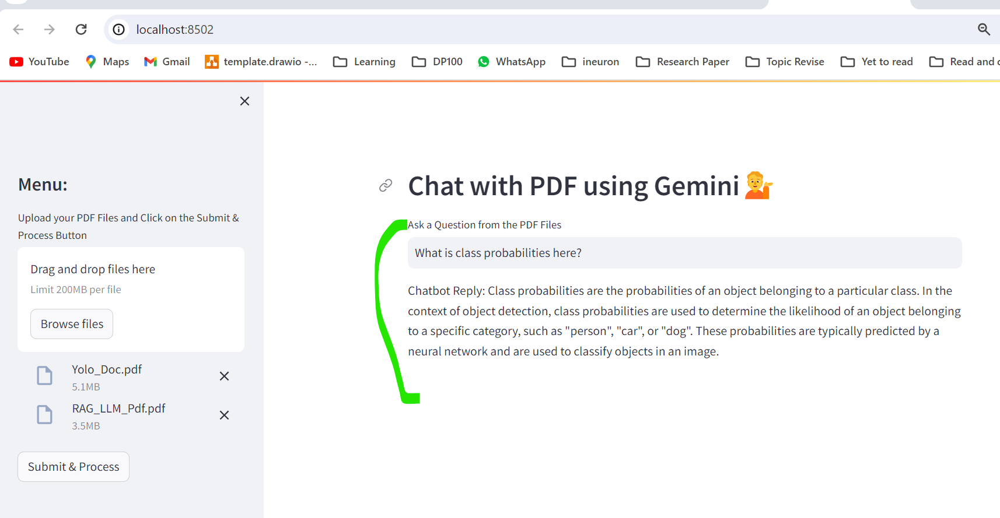

# Chat with MultiplePDF - (using Langchain FAISS GeminiPro Streamlitapp)

- In **Streamlit Webpage** Right side we upload multiple PDF's and press **Submit and Process**
- Then it apply **embedding on uploaded PDF files and stores FAISS In memory Index** and then we ask Q on that pdf to get detailed/Summary information.
- It helps to **understand any PDF by Question and answer way**.
- Here we are building Basic **RAG** end to end project,
- We created **FAISS vector DB** for our uploaded PDF's , It reads lines in pdf files and make as **In memory Local Knowledge base**
- Used OpenAI model **Gemini Pro Model - ChatGoogleGenerativeAI** to produce the final output in **Streamlit webpage**
- Added **Langchain Conversation buffer memory**

## Yet to explore more

- Apply Chat Memory ( - 1.Langchain Buffermemory - 2. Streamlt app's chatmemory (Keep streamlit as just webpage only) - 3. End application will holds chat and passes to main script as current Q + Chathistory
  )
- Switch to LlamaIndex method to support faster and better retrival
- Switch from Storage FAISS local memory to some no sql server for storage
- Add RAG Model Evaluation steps
- Test is this reads any table info if pdf has any table data
- Have a control to Switch Multiple LLM Model at the end

# Files

- **chatpdf_app.py:** Main file uses Streamlit and creates basic webpage and calls all main actions
- **src/helper:** Holds all main functions, which will be called inside chatpdf_app.py (Read pdf, chunking, knowledge base creation tasks etc)
- **init.py** It helps to treat src folder's all files as package/internal library in **setup.py**
- **setup.py:** It helps to convert src folder's **helper.py** files as package/internal library
- **requirement.txt:** Holds all required packages and its version
- **faiss_index_db folder:** FAISS db all embeddings/Knowledge base saved here as **Local Knowledge base**, it wont be pushed to BB
- **Generative_AI_Project.egg-info:** - This is the local package created on helper.py file, it wont be pushed to BB
- **.env:** Holds Gemini API Key, it wont be pushed to BB
- **tempalte.py:** Holds initial foder structure skeleton

# Steps written in chatpdf_app.py

- Here we created **chatpdf_app.py** file, it holds core script.
- Initiate the Streamlit

## Upload external PDF from streamlit webpage and Local Vector DB creation

- In Streamlit Front end upload the **Multiple PDF's ** ,it will apply embedding and stores in **In-memory FAISS DB**

- Inside **chatpdf_app.py** it calls all function from **helper.py**
  - In **get_pdf_text** uses - **PdfReader** to read the all **pages in pdf** files and saves as 1 text
  - Then Split Text into Chunks. For this we used **Langchain's RecursiveCharacterTextSplitter**
  - Use the **GoogleGenerativeAIEmbeddings(model="models/embedding-001")** Model via Langchain and convert chunk to vector and stores embedding in local db - **FAISS db** inside folder **faiss_index_db**

## Use ChatGoogleGenerativeAI(model="gemini-pro") from Langchain as LLM model and Build RAG

- Used langchain's **load_qa_chain with ConversationBufferMemory** to retrive FAISS db context for User Q with prompt teplate
- Used **ChatGoogleGenerativeAI(model="gemini-pro") AS LLM** with **load_qa_chain** created langchain's QA chain [RAG]

## Streamlit Front End

- 1st need to upload PDF Files and and press **Submit and Process** and ask Q,
- In backend it creates **FAISS Vector DB and and provides O/P** for user Q

# How to run?

### STEPS:

Clone the repository

```bash
Project repo: https://github.com/
```

### STEP 01- Create a conda environment after opening the repository

Here we need python 3.9 and above for geminipro

```bash
conda create -n gemenv python=3.9 -y
```

```bash
conda activate gemenv
```

### STEP 02- install the requirements

```bash
pip install -r requirements.txt
```

### Create a `.env` file in the root directory and add your GOOGLE_API_KEY credentials as follows:

```ini
GOOGLE_API_KEY = "xxxxxxxxxxxxxxxxxxxxxxxxxxxxx"
```

```bash
# Finally run the following command
streamlit run chatpdf_app.py
```

Now,

```bash
open up localhost: http://localhost:8080
```

- upload invoice image and ask Q, THEN it gives response

```bash
# Finally Stop the app
ctrl + C
```

### Techstack Used:

- Python
- LangChain
- Stramlit
- Google Gemini Pro - ChatGoogleGenerativeAI
- FAISS DB Local memory

### Streamlit App:




