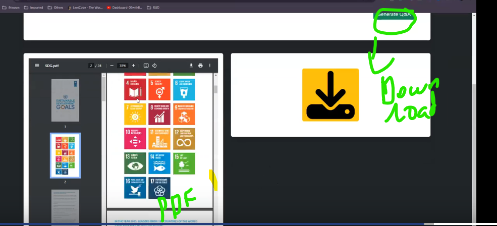

# Interview-Question-Creator-Project

- Generate Q&A from document.
- Here we built end to end project in local

## Steps:

- Create env

  ```bash
  conda create -n interview python=3.10 -y
  conda activate interview
  ```

- Create standard **template.py** file and mention all standard SUB folder required in our main folder.

  - Then run this commands to create all subfolder

  ```bash
      python template.py
  ```

  

- Keep all library names inside requirements.txt [Keep -e . also, this helps to execute setup.py to create local library]
- Keep STANDARD content in **setup.py**. This will search **init**.py constructiure files folder which is src folder, then it treats src as local library and creates library here

- Install requirements

  ```bash
  pip install -r requirements.txt
  ```

- Set openapi key in .env file. Its used during "OPENAI_API_KEY = os.getenv("OPENAI_API_KEY")" But dont push to BB.

- Create main code in **research/trials.ipynb**. Then convert it to moduler code

  - **Content in trial.py**

    - Uses OpenAI model
    - Read PDF and do chunking using - **TokenTextSplitter** and passed model name during chunking. **Reason:** This llm model helps to remeber context of each chunks and will remeber what is the previous and next chunk for each of the chunks.

      - To generate Question: Split into chunks - Bigger chunk size(10000)
      - To generate Answer: Split into chunks - Smaller chunk size(1000)

        

    - Convert Chunk to document form before embedding
    - Created prompt to generate and Refine template prompt to refine that previously created Q
    - Use Chain - **load_summarize_chain** to generate Q. Here Bigger chunk: **document_ques_gen** are used to generate Q
    - Then Initalize **FAISS Db** and embedding model and openAI model for **ans** generation . Here smaller chunks: **document_answer_gen** are loaded to Faiss db
    - Create retriver chain using **RetrievalQA** and generate **answer** from openai model uing **RAG approach**

- Create **moduler code**

  - **Helper.py:**

    - Whole code written in **trail.py** are written in moduler form. Once we execute this function, it gives Q+A pair

  - **prompt.py:**
    - Prompt are written in seperate file and called in helper.py

- Create **App.py**

  - Here used **fastapi** to create simple **UI**

    - **templates/index.html**

      - Standard UI design and key features like below are written in this file.

      ```
          let result = document.getElementById('result');
          let loader = document.getElementById('loader');
          let download = document.getElementById('download');
          let viewPdf = document.getElementById('view-pdf');
          let downloadBtn = document.getElementById('download-btn');
      ```

      - Frontend design UI sample index.html downloaded from

        ```https://getbootstrap.com/docs/4.0/examples/

        ```

  - Execute app.py and gives local host link https://localhost:8000. Open that in web and get the front end
    ```bash
    python app.py
    ```
  - Once we upload file and submit "Generate Q+A" button, we will get doc in left side and right side download button to download Q+A csv file.

  
  
  
