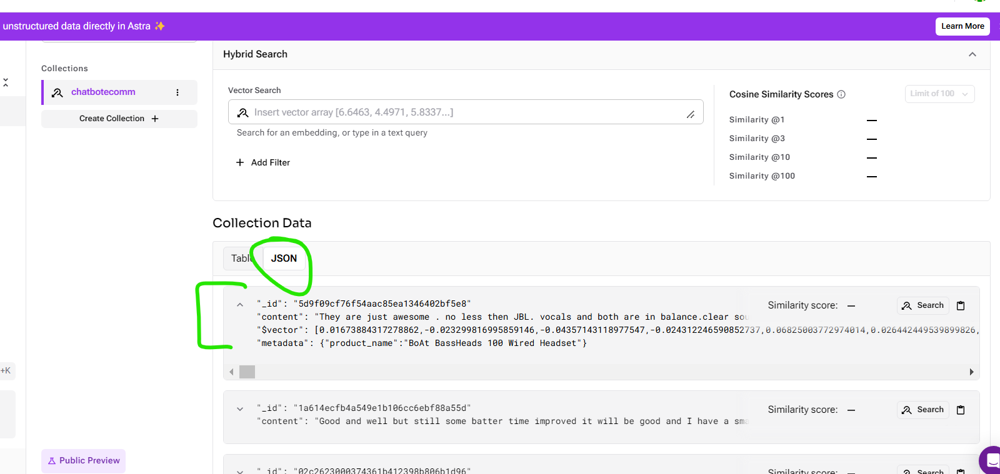

# Ecommerce Chatbot

Welcome to the Ecommerce Chatbot project! This chatbot is designed to assist users with their online shopping experience by providing product recommendations, answering questions, and assisting with various inquiries related to the ecommerce store.

## Overview

The Ecommerce Chatbot is built using Python and Flask framework. It leverages natural language processing (NLP) techniques to understand user queries and generate appropriate responses. The chatbot integrates with the ecommerce store's product database to provide personalized recommendations and information about available products.

## Features

- Interactive chat interface for users to interact with the chatbot.
- Natural language processing for understanding user queries.
- Product recommendation engine based on user preferences and browsing history.
- Integration with the ecommerce store's product database.
- Ability to handle various user inquiries such as product availability, pricing, shipping information, etc.

## STEPS:

- **Data**

  - Already flipcart scrapped data kept in data folder data. flipkart_product_review.csv

- **ASTRA DB** used as **vectordb**
- Google generative AI in langchain framewok used, **Gemini** embedding used or **openAI** embedding used
- **ASTRA DB**

  - Login to Astra Db:

    ```
    https://astra.datastax.com/org/fb5fb8c1-4da3-43c9-bc9c-77a446d7583f/database

    ```

  - Create Database inside Astra DB
    

  - Copy endpoint and generate token from Astradb new db in our local .env
    

- Click on the load data to get Key space. Here ASTRA_DB_KEYSPACE = "default_keyspace"
  

- **Data_converter.py**

  - Whenever save data in **Astradb** It should be in list. which is list of document format
  - In this script , we converts csv data into specific format data[each rows to Document format with page_content value and its metadata info] inside list
  - **Actual data**
    
  - **Converted data after executing this script**
    

- **ingest.py**
  - This script will load list of document format data to Astra DB and applies embedding on data and stores in vector format
  - Once we run this script individually, it loads list of document to Astradb
  ```
  python ingest.py
  ```
- Data inside Astra Db.
  
  

- **retrieval_generation.py**

  - In this script it Retrives info from Astra DB Based on User Q and system prompt which we defined.
  - Here used **gemini-2.0-flash-exp** new model

- **app.py**

  - This is final application build script, here we combine all moduler code written for RAG in sequesce and create simple frontend using Flask

  ```
  python app.py
  ```

  

## Installation

To set up the Ecommerce Chatbot locally, follow these steps:

1. Clone the repository to your local machine:

```
   git clone https://github.com/your-username/ecommerce-chatbot.git
```

2. Navigate to the project directory:

```
   cd ecommerce-chatbot
   cd "D:\Prabha\Data Science\Prabha-DS\Gen_AI\Ineuron\Gen_AI_Course\Project\github\Gen_AI_Projects\08_Project\06_E_Commerce_Chatbot_main"
```

3. Activate venv if already there.

```
   conda activate "D:\Prabha\Data Science\Prabha-DS\Gen_AI\Ineuron\Gen_AI_Course\Project\venv_new"
```

4. Install the required Python packages using pip:

```
pip install -r requirements.txt
```

5. Already flipcart scrapped data kept in data folder. flipkart_product_review.csv

6. Create standard **template.py** file and mention all standard SUB folder required in our main folder.

- Then run this commands to create all subfolder

```bash
    python template.py
```

6. Set up environment variables:

- Create a .env file in the project directory.
- Define the necessary environment variables such as database connection strings, API keys, etc.

- Keep STANDARD content in **setup.py**. This will search **init**.py constructiure files folder which is src folder, then it treats src as local library and creates library here

- templates/chat.html: This html content we copied from internet

6. Run the Flask application:

```
python app.py
```
