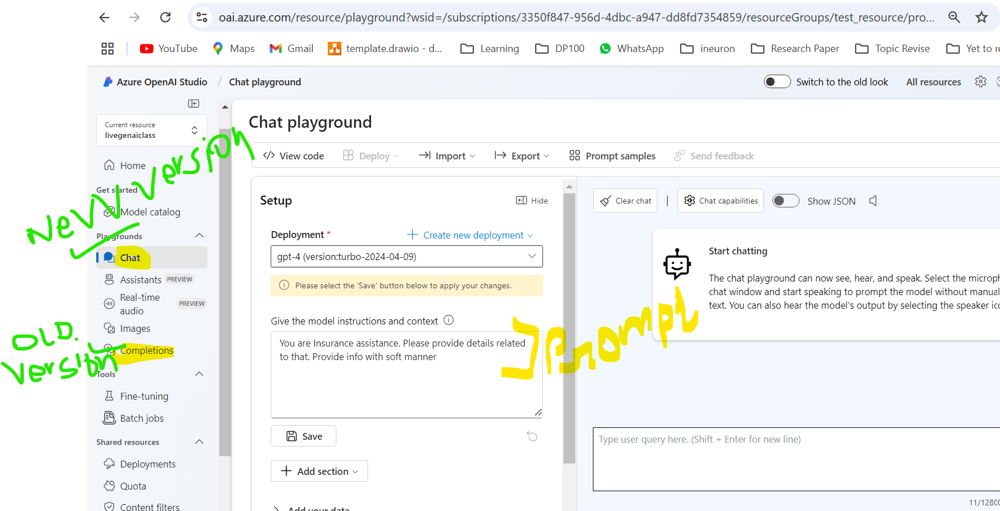

# AZURE BASIC SETUP - AZURE OPENAI SERVICE

- https://portal.azure.com/#home
- Do azure subscription
- Open Azure OpenAI service and create the resource by selection region

**OpenAI resource creation**

**OpenAI resource created**

**OpenAI resource inside service**

- Then go to deployment so it open 'Azure OpenAI Studio'.
- There to use OPENAI Model, select specific model from deployment tab and do the deployment. So that specific openai model will be available to us.

**AzureOpenAI studio**

**AzureOpenAI studio - Model catalog**

**AzureOpenAI studio - Quota**

**AzureOpenAI studio 3 - Deploy model**

**AzureOpenAI studio 4 - Deploy model**

**AzureOpenAI studio 5 - GPT4 Model**

**AzureOpenAI studio 5.1 - GPT4 Model deployed**

**AzureOpenAI studio 6 - Playground**

- Now we can open Playground and can see the Openai Model which we deployed.

**Palyground -1**

**Palyground -2**

## Chat completion:

- There chat(new model) and chat completion(for old model) 2 options available
- There we can ask Q and add system prompt and can change probabilty, temperature etc to get response

**chat_completion**

**Chat_inference_code**

**Chat_inference_code_2**

### Execute backend code in VS

- There we can see backend code also,
- That code we can copy and try to connect to AzureOpenAI connection from local cmd as well.

  - Create new conda venv nd install these library
    ` conda info --envs`
    `conda activate "D:\Prabha\Data Science\Prabha-DS\Gen_AI\Ineuron\Gen_AI_Course\Project\azure_opnai_env_310"`

    pip install azureopenai  
    or
    pip install openai
    pip install python-dotenv
    pip install Pillow

  - Execute:
    python chat_completion_code.py

- Showed how to build simple RAG in Azure playground Chat - "Add yur own data"
  - Showed how to create to Datastore(Blob Storage) and Azure AI Search in Azure etc
  - Uploaded RAG document and selected Keyword search etc and chunk size
- How to lauch webapp for that simple RAG

**chat_completion_run_in_vscode**

## Image generation:

- Image generation Using DALLE model in Image playground
- Input the Q, it generates image. It takes 5 min to deploy this automatically. later we can execute the backend code in vscode also

**Dalle_image_generation_in_playground**

### Execute backend code in VS

- Press View code and use that code and copy local as .py file to run in vscode
- Added print(image_url) at the end of the code
  - Execute:
    python image_generation_code.py
