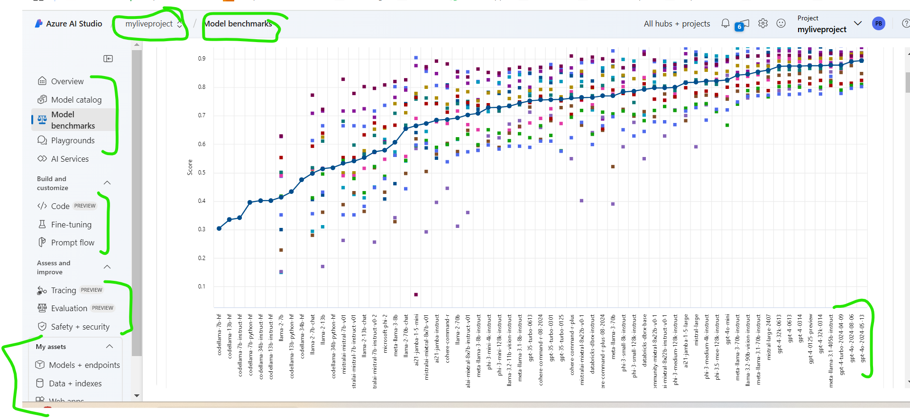
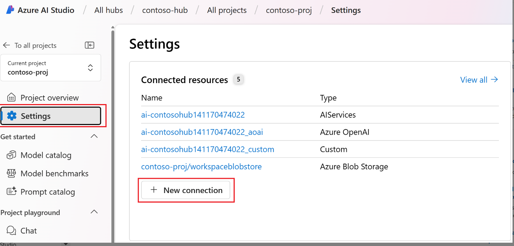
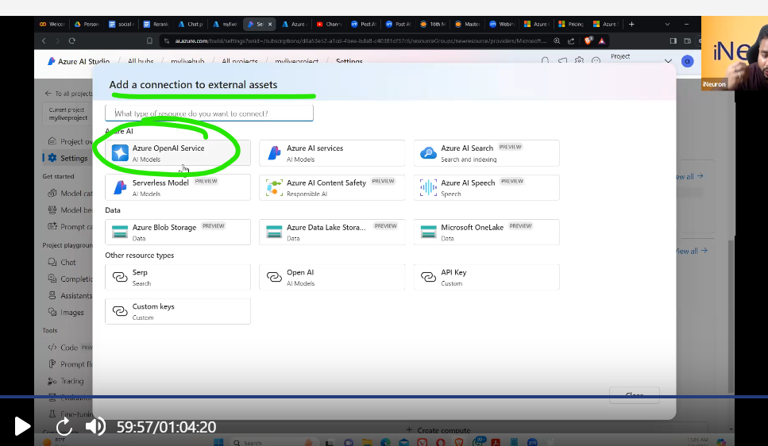
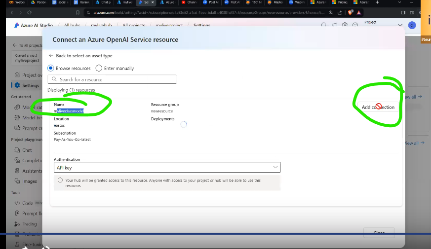
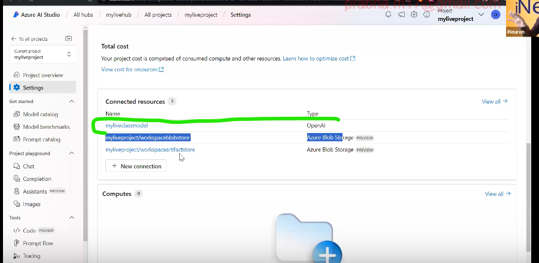
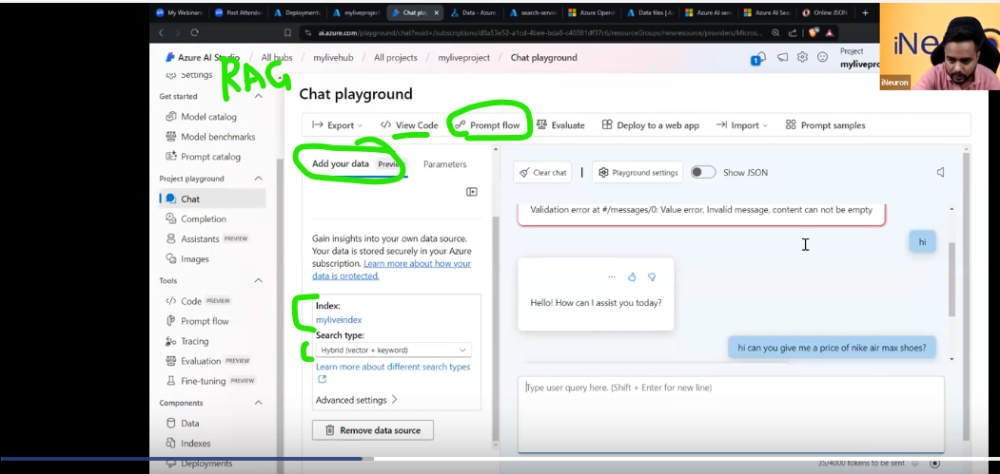
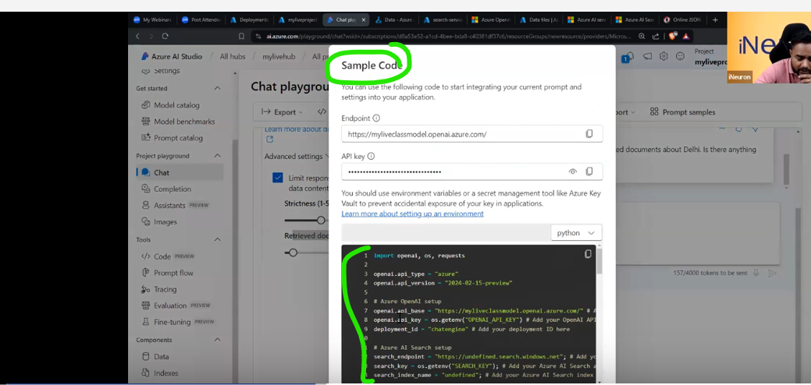
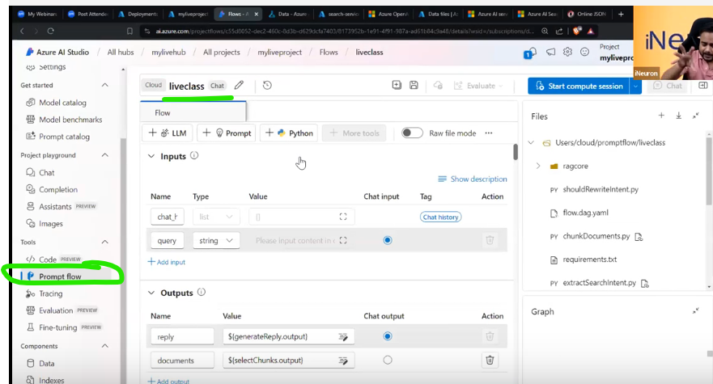
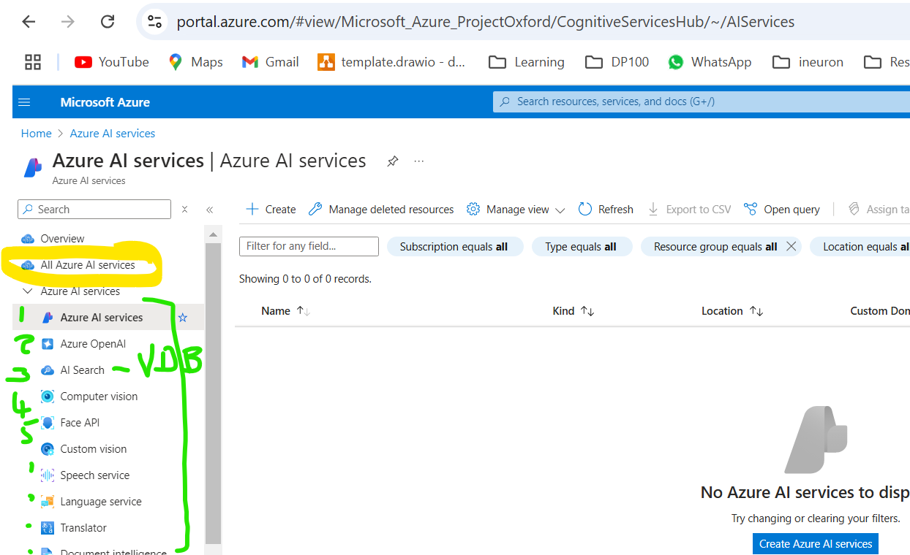
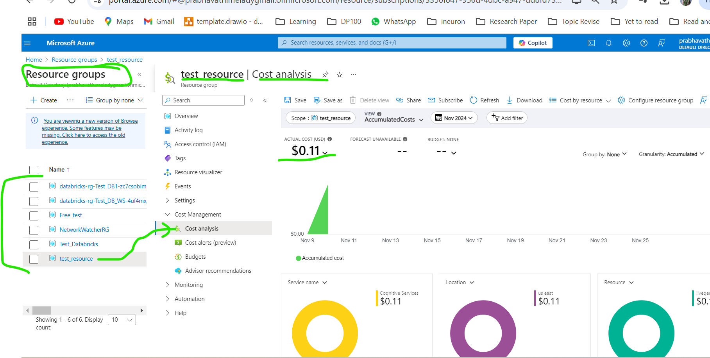

# AZURE BASIC SETUP - AZURE AI STUDIO

, Fine Tuning, under asset- Model Endpoint, data index etc.
  

- **Add new connection**
- https://learn.microsoft.com/en-us/azure/ai-studio/how-to/connections-add
- Then connect Azure Open AI service which we created earlier class, there we downloaded gpt4 model and created endpoint for that model.
- Follow this step inside Azure AI Studio's
  - Azure AI Studio --> Setting --> New Connection
    
- But now to some new enahancement this setting not visble in Azure AI studio. Copied some snapshot from video

  

  

  

- After this we can invoke GPT4 model, which deployed in Azure OpenAI service in Azure AI studio.

## Build RAG in playground using already created/deployed Azure OpenAI endpoint

- Showed how to Create RAG inside AZURE AI Studio UI using Azure AI search service and Azure OpenaAI service's embedding model .
- Once its done, copied that backend code and executed that in local, so It does same RAG in local, which calls the same RAG Knowledge base and does inference. Code link: https://github.com/sunnysavita10/AzureOpenAI-Crash-Course/blob/main/app.py
- In above github, he has mutiple subfolder, there he has kept some sample code to use azure openai endpoint anddo the finetuning, voice data, function calling etc
  **12_RAG_in_playground**

  

**13_RAG_backend_code**

**14_RAG_prompt_flow**

- Showed promptflow, which helps to do endtoend pipeline which we done in playground setup. and showed deployment.

  

**Azure_service**

**Cost_analysis**

