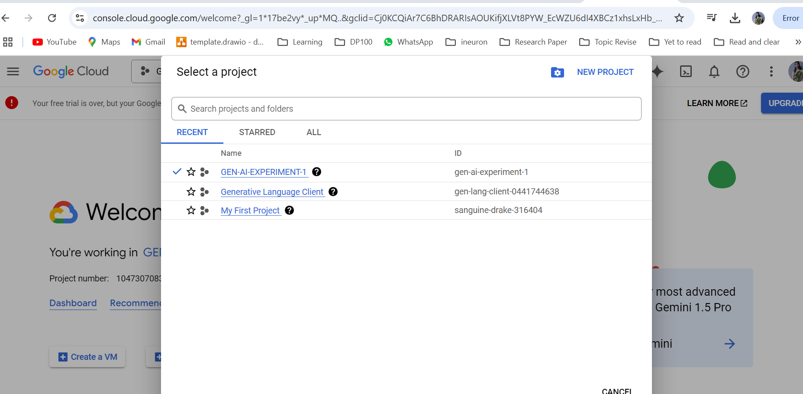
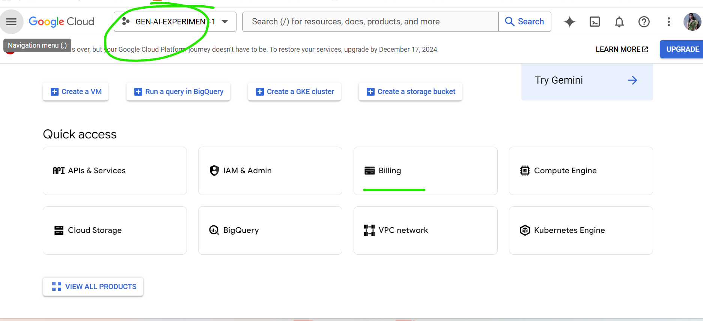
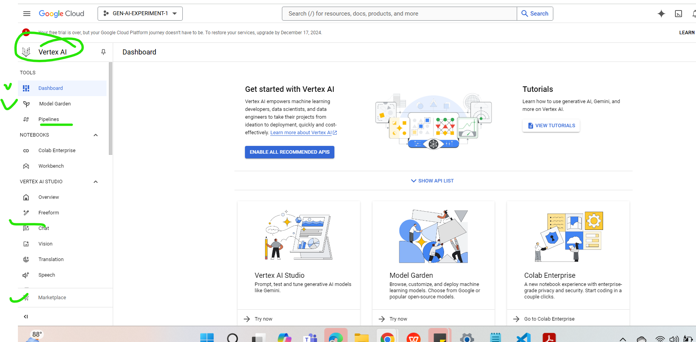
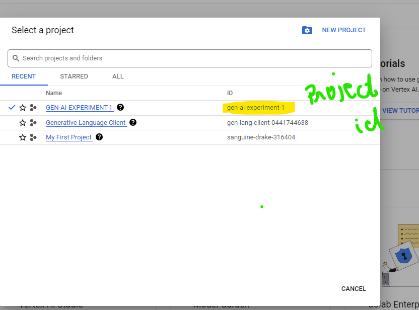
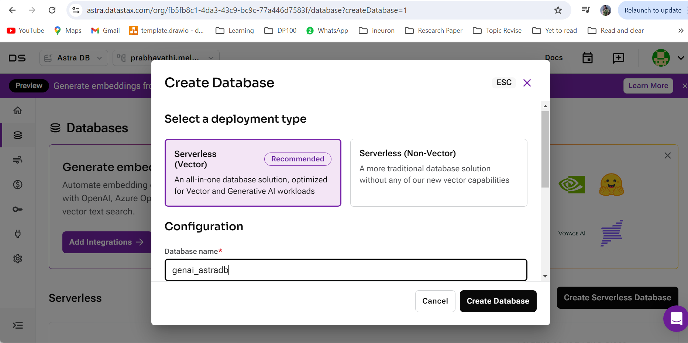
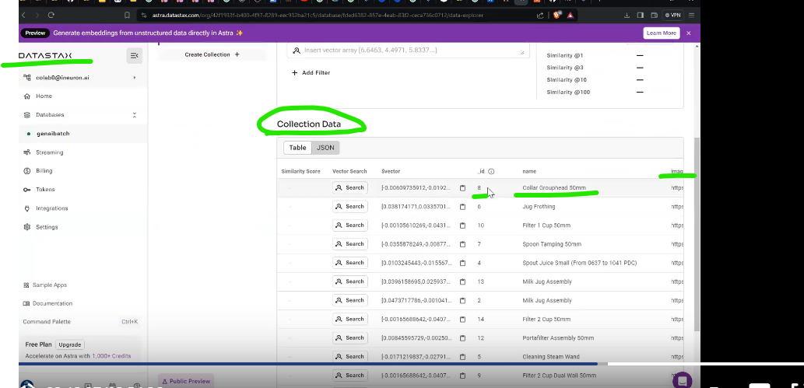
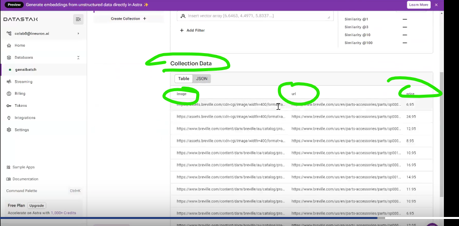

# Google Cloud Platform - GCP

- We will use our gmail account coonect to GCP
- https://console.cloud.google.com/welcome?_gl=1*17be2vy*_up*MQ..&gclid=Cj0KCQiAr7C6BhDRARIsAOUKifjXLVt8PYW_EcWZU6dI4XBCz1xhsLxHb_YczZQcJgTy6FHIvQ2hYqMaArW_EALw_wcB&gclsrc=aw.ds&hl=en&project=gen-ai-experiment-1
- To use GCP we need to create project 1st.
- Vertex AI is like Amazon's Bedrok or Azure's Cloud
- Overview of GCP and VERTEX AI and invoked 1 gemini model in notebook

- **gcp_acct_1**
  
  

- **Vertex_home**
  

- **Get Project_id**
  

## RAG Model(Image similarity):

- Then ASTRADB as db used RAG Model.
- Configured db in astra db and that endpoint and application token used here to connect to Astra db
  

- I can pass the image and based on that i can take a recommendation from my model.
- Here we setup data with image url, this rag will helps to search similar image from the knowldge base url and gives the best match image and its url
- Here we do multimodal retrival, so used multimodal LLM - **multimodalembedding@001**
- Do Embedding of image: load the image from filesystem and compute the embedding value using above multimodal embedding(No chunking concept in image, resolution can be reduced)
- Save image embedding in the AstraDB Vector Database




- Reference: What is image embedding
  ```
  https://blog.roboflow.com/what-is-an-image-embedding/
  ```
- Now do the similarity search n image embedding data saved in astradb (RAG Way)
  - Search similar image in knowledge base in collection using key word - vector_find
- Final Generation part by passing image_message + text_message to **gemini-1.0-pro-vision**
- Get final similar image recommendation with image, url and price.

## ------------------------------------------------

## Google AI Studio and Vertex AI:

- Google AI Studio and Vertex AI are both AI tools from Google Cloud, but they have different features and use cases:

### Features

- Google AI Studio is limited by queries per minute (QPM), requests per minute (RPM), and tokens per minute (TPM). Vertex AI has more flexible quotas that are shared across all applications using a project. Vertex AI also offers:
  - A wide range of machine learning models, including pretrained models and custom model creation
  - Fully managed tools
  - Data science workflow
  - Customization and integration
  - MLOps tools
  - Model tuning to customize the default behavior of foundation models
  - Model evaluation tools to assess the performance of tuned models
  - Access to Gemini multimodal models, which can understand almost any input and generate almost any output
  - A managed environment called Generative AI Studio where developers and data scientists can interact with, tune, and deploy foundation models
