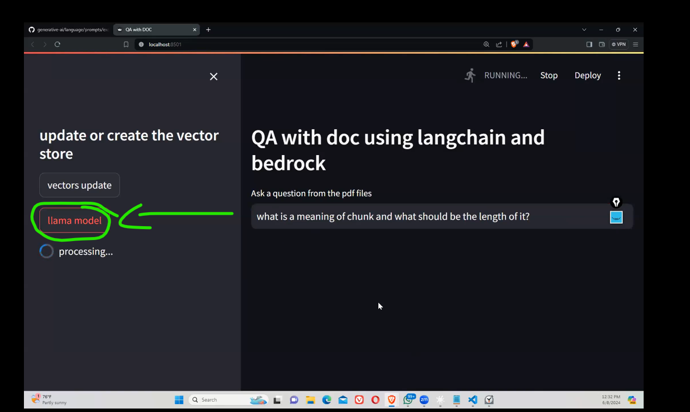
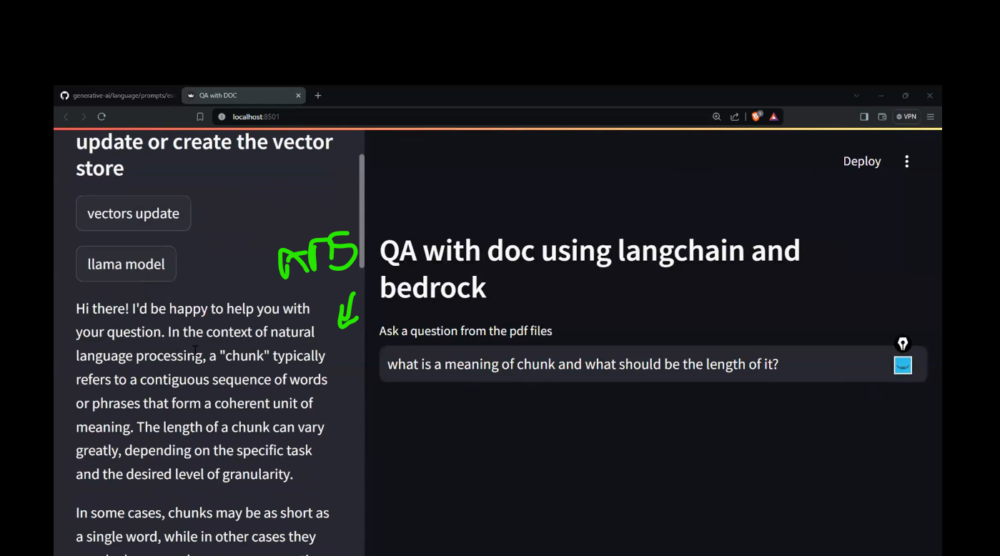

# Deploying RAG APPLICATION using AWS(AWS lambda,AWS ECR), Langchain, Huggingface, Docker

- AWS Bedrock, How to connect AWS service etc with bedroc boto client

- To use AWS in our local, we need to install aws cls in our system
- In terminal type **aws configure** to connect to AWS api_key connection. Refer video
- Here showed simple RAG method SDK code written in VS and used FAISS Db. llama model and amazon titan embedding model invoked using amazon bedrock client and did vector index retrival and created frontend in streatmlit app.py

- Main code written inside scripts in folder qasystem and made that as local library using **setup.py** script.
- Then written **app.py** for streamlit

  

  

- Github refernce page: RAG-With-AWS-Lambda-ECR-Docker-Langchain-Huggingface-

```
 https://github.com/sunnysavita10/RAG-With-AWS-Lambda-ECR-Docker-Langchain-Huggingface-
```
