# Mastering AutoGen: Building Multi-Agent Systems [NEW]

### Description

-Built and explore the power of AutoGen to build and customize multi-agent systems for automating complex workflows. This comprehensive guide will take we through the fundamental concepts of multi-agent systems, effective implementation strategies, and best practices for using AutoGen. we will learn how to configure and deploy various types of agents, such as AssistantAgent and UserProxyAgent, and see how these agents can collaborate to accomplish sophisticated tasks.

### What we Will Learn:

- **Multi-Agent Systems:** Understand the core principles of multi-agent systems and their benefits in automating complex workflows.

- **Agentic Design Patterns:** Learn about different agentic design patterns and how to apply them to solve real-world problems efficiently.

- **Automation of Research Tasks:** Discover how to automate the retrieval, analysis, and visualization of research papers, enhancing productivity and insight generation.

- **Advanced NLP and LLM Techniques:** Gain practical knowledge in configuring and utilizing large language models (LLMs) and natural language processing (NLP) techniques to process and analyze textual data.

- **Visualization and Data Presentation:** Master the creation of visual tools such as bar charts to present your analysis results effectively.

- **Enterprise Use Cases:** Explore enterprise-level use cases and best practices for integrating AutoGen into professional workflows.

If want to master AutoGen and build multi-agent systems that are highly customizable, then this course is for you.

### STEPS:

- Keep .env file and keep openai credential. But if we set in lenova laptop's system variable, then it reads from there nly
- Go to virtual env.
  ```
  conda activate "D:\Prabha\Data Science\Prabha-DS\Gen_AI\Ineuron\Gen_AI_Course\Project\azure_opnai_env_310"
  ```
- Install Pip package

```
    cd "D:\Prabha\Data Science\Prabha-DS\Gen_AI\Ineuron\Gen_AI_Course\Project\github\Gen_AI_Projects\16_Learning\02_AutoGen_Building_Multi_Agent_Systems\autogen_course_main"

    pip install requirements.txt
    or
    directly in terminal
    pip install matplotlib numpy
    pip install pyautogen

```

- **Execute**

# Basic

```
  cd 01_intro
  python simple_conv_agent.py

  python assis_proxy_agent.py
```

# Code executer -> Writes and execute code in local

```
  cd 02_code_executors
  python simple_code_executor.py


```

# Input Modes

always_mode: Always asks User
never_mode: Never asks User
terminate_mode: Asks only when terminating

```
  cd 03_input_modes
  python always_mode.py
  python never_mode.py
  python terminate_mode.py


```

# Tools

```
  cd 04_autogen_tools
  python travel_planner_tools.py
  python travel_tools.py

```

# conversation_patterns

### conversation_pattern

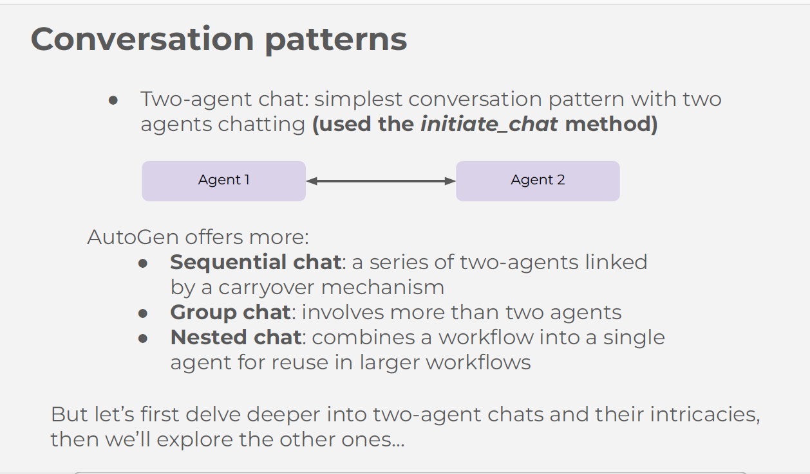

### two_agent_chat

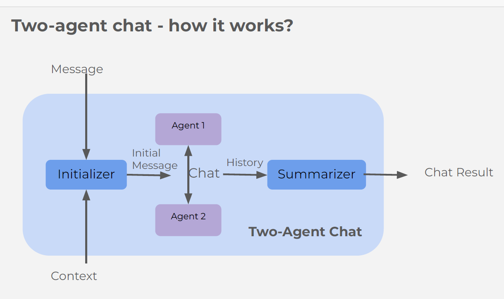

- In sequential chat so many summary will be created.

### sequential_chat

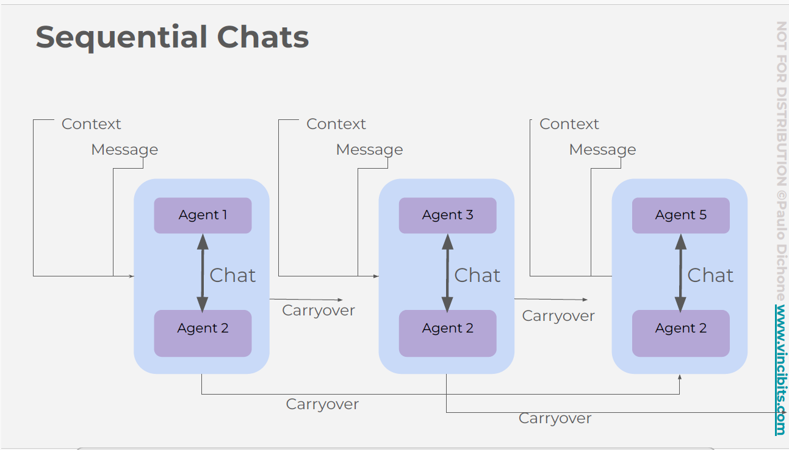

```
  cd 05_conversation_patterns
  python seq_chat_agents.py
  python travel_planner_agents.py

```

# Group Chat

- In **group_chat_in_seq.py** script showed, groupchat inside sequential chat

### group_chat

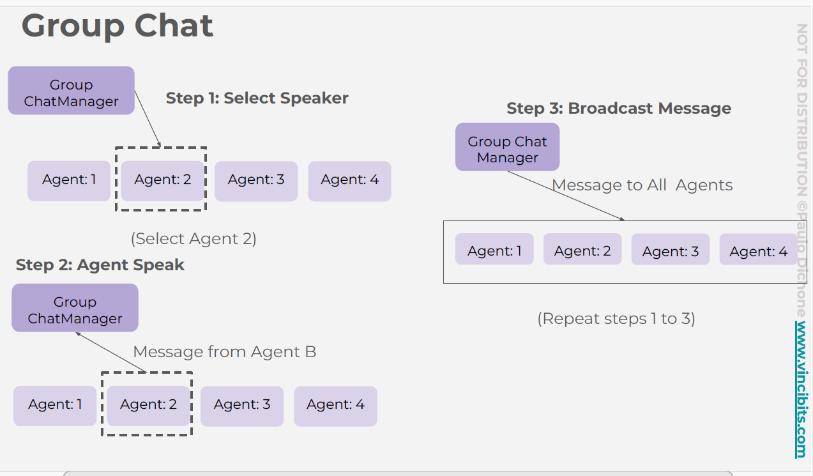

```
  cd 06_group_chat
  python group_chat_simple.py
  python group_chat_in_seq.py

```

# Nested Chat

- In nested chat it passes prev chat content with Q details to next agent which we mentioned by main agent where we registered nested agent.
- Here main agent (User Proxy) for each next agent, it passes prev agents all responses as context.

- In **nested_chat_simple.py** script showed, Nested chat with **Critic and reflection** in it. Critic will get Q and response from main agent and does critic and then response refined by main agent

### nested_chat

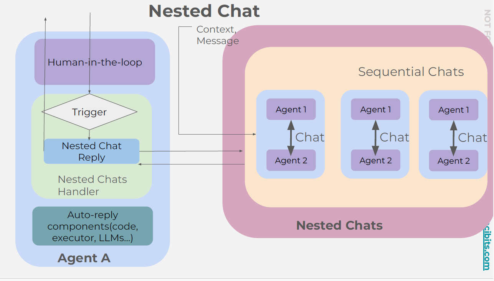

### nested_chat

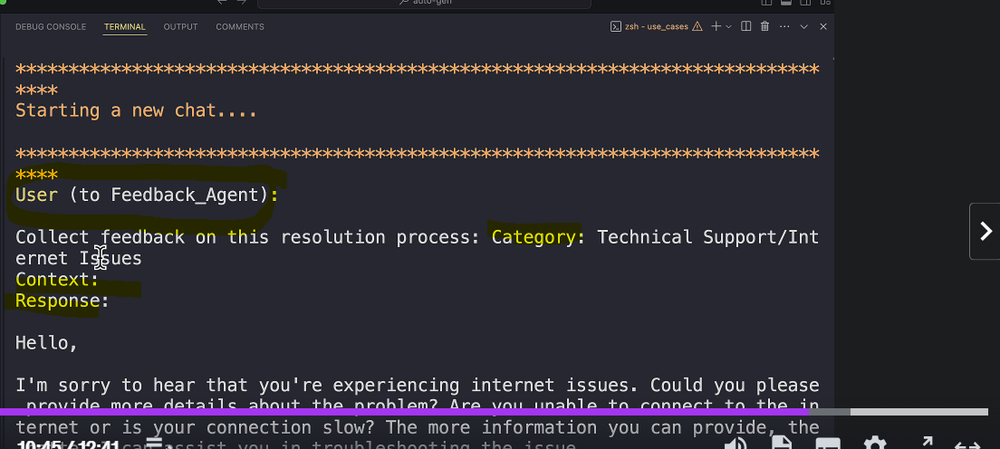

### nested_chat_with_refection

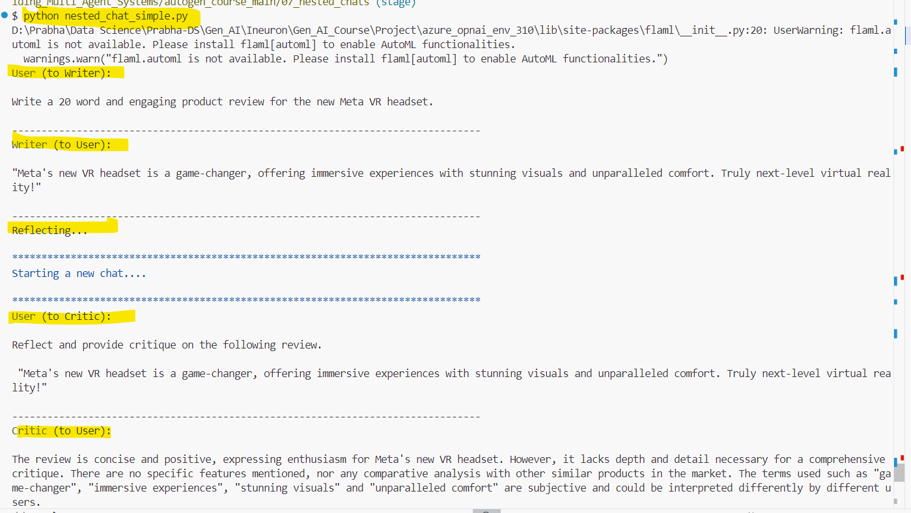
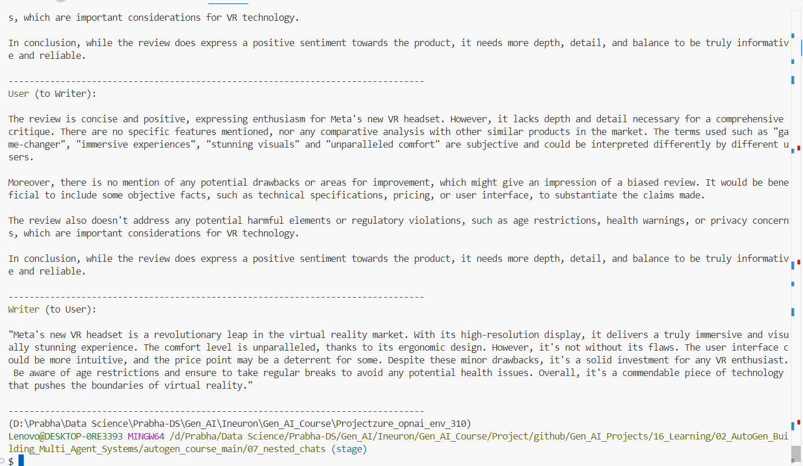

```
  cd 07_nested_chats
  python nested_chat_simple.py
```

# Use Case

### customer_support_workflow

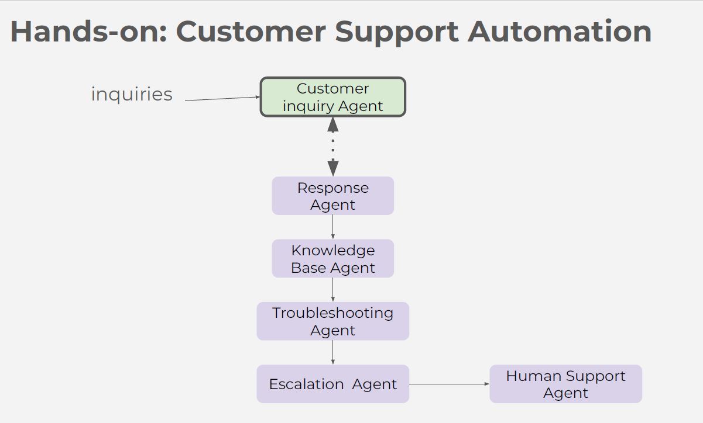

- In **customer_support_workflow.py** script showed, **Nested chat** with with multple agents in it.

### financial_report_automation

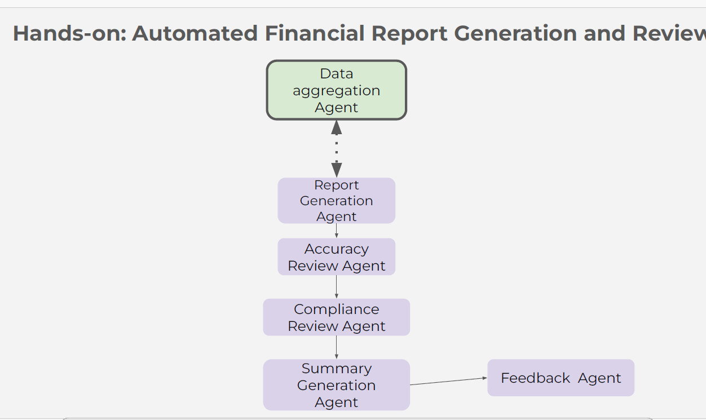

- In **financial_report_automation.py** script showed, **Nested chat** with with multple agents and **csv file read** in it.

### research_paper_automation

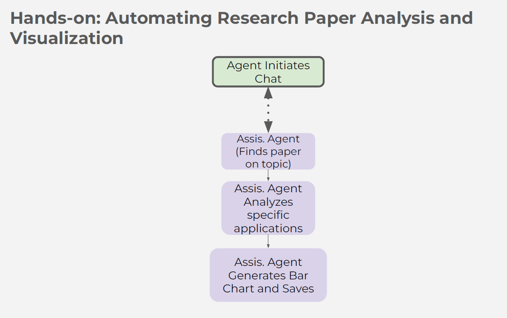

- In **research_paper_automation.py** script showed, **Simple chat which manually made sequential** with with multple agents and **pdf file read** in it.

```
  cd 08_use_cases
  python customer_support_workflow.py
  python financial_report_automation.py
  python research_paper_automation.py

```
